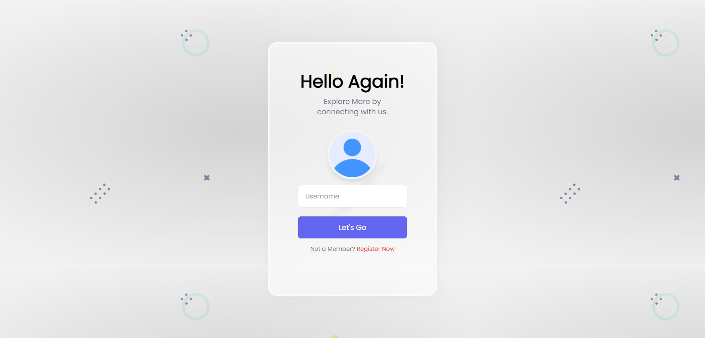

# MERN User Authentication App

This project is a MERN Stack App with User Authentication. It includes login, registration, profile, and reset password routes. It also shows how to send mail from the Node.js backend application.



## Tech Stack

The website is built using the following technologies:

- MongoDB
- Express.js
- React.js
- Node.js

## Features

- Fully Responsive
- User Friendly Design
- Tostify Notifications
- Reset Password
- OTP Verification
- Profile Update with image

## Usage

To use the this User Authentication App, simply follow this steps :

1. Clone the repository :

```bash
   git clone https://github.com/chiragpgauswami/mern-authentication-app.git
```

2. Open the project folder :

```bash
   cd mern-authentication-app
```

3. Client side :

- Install dependencies :

```bash
   cd client
```

```bash
   npm install
```

- In the Client Folder create .env file and put this code inside it :

```bash
REACT_APP_SERVER_DOMAIN='<server_domain>' # example 'http://localhost:8080'
```

- Start the development server :

```bash
   npm start
```

4. Server side :

- Install dependencies :

```bash
   cd server
```

```bash
   npm install
```

- create a file in the Server Folder with the name config.js and put the below code inside it :

```bash
export default {
    JWT_SECRET : "<secret>",
    EMAIL: "steve.franecki@ethereal.email", // testing email & password
    EMAIL_PASSWORD : "sMf46xCzrvdrxvuagc",
    mongoURI: "<MONGODB_ATLAS_URI>"
}
```

- Start the development server :

```bash
   npm start
```

5. Open your web browser and visit http://localhost:3000 to see the website.

## Routes

- `/` : This route is used to login to the application.
- `/register` : This route is used to register a new user.
- `/profile` : This route is used to view your profile information.
- `/reset` : This route is used to reset your password.

## Customization

You can customize the User Authentication App's UI by modifying the CSS styles in the Index.css file. Feel free to experiment with different colors, fonts, and layout arrangements.

## Contributing

Contributions are welcome! If you find any issues or want to add new features, please open an issue or submit a pull request.

## Author

This project was created by Chirag P. Gauswami.

## License

This project is Open Source you can use it.

## Links

- [Source Code](https://github.com/chiragpgauswami/mern-authentication-app)
